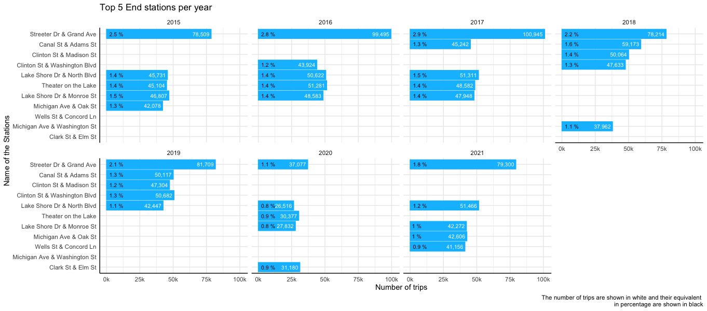

Cyclistic Case Study 2015 to 2021
================
Juan Cordova
4/7/2022

Case Study project

This project was carried out as a data analysis exercise with a real
dataset, The data and idea of the project were part of the **Google Data
Analysis course** , which is used to obtain the **Data Analysis
Certificate** from Google. The analysis, visualizations, conclusions and
recommendations were done by me.

The data is provided by Bikeshare (Divvy), a company who operates the
City of Chicago’s bike-sharing service, (you can see the license to use
the data ***here***).

For this exercise, the name Cyclistic will be used as the fictitious
company that provides the data.

## Case Study: Cyclistic Bike-Share from 2015 to 2021

### Scenario

Being a junior data analyst working in the marketing team at Cyclistic,
a share-bike company in the city of Chicago, you now have to develop the
following project. The director of marketing believes that the future of
the company depends on maximizing the number of annual members.
Therefore, it is necessary to know how casual riders and annual members
use the Cyclistic service, so that their differences are known in order
to carry out a marketing strategy campaign that seeks to convert casual
riders into annual members.

The team leader asks you to answer the following question:

-   How do annual members and casual riders use Cyclistic bikes
    differently?

### Business Task

**Problem:** *How do annual members and casual riders use Cyclistic
bikes differently?*

What is intended?

-   Learn how casual cyclists and annual subscribers use the bike-share
    service

How would it be achieved?

-   By Analyzing the data provided by Cyclistics

What is the analysis looking for?

-   Find discoveries between the differences between the two types of
    users of the system, in order to make data-driven decisions

What will be generated?

-   A summary of the analysis

-   Supporting visualizations and key findings

-   Main recommendations based on the analysis done that will respond to
    the question posed.

### Data sources used

All the files the company Cyclistics provided were downloaded, sorting
the data by year, creating a file containing all the data for each year,
from 2015 to 2021

All these data were organized in a folder in chronological order. First
Using the **rbin()** function, all the tables of each year were joined,
obtaining seven files referring to the years from 2015 to 2021. These
files then went through a cleaning process in order to be united into a
single file that encompasses the seven years

### Documentation of data cleaning

**Process:** *Check each column, that what it should be is fulfilled,
checking the data type and if there are errors correct them*

The files of each year will be structured in the same way, having in
them the same number of columns, with the same type of data, even when
there are discrepancies in some years where there are columns with
information that in others do not, that column will simply be added to
the year that does not have that information and it will be filled with
blank values (NA).

**Documentation**

The files will be arranged in 13 columns:

-   6 columns with a character data type: *trip_id, rideable_type,
    from_station_name, to_station_name, new_usertype, gender*

-   5 columns with a numeric data type: *bikeid, from_station_id,
    to_station_id, tripduration, age*

-   2 columns with POSIXct data type (date format): *starttime,
    stoptime*

**Cleaning** Data cleaning was carried out so that the columns meet the
following specifications:

***trip_id:*** id number (2015 to 2019) or id code (2020 to 2021) of the
trip

***rideable_type:*** type of bike used (only applies for 2020 and 2021)

***from_station_name:*** name of the station where the trip starts

***to_station_name:*** name of the station where the trip ends

***bikeid:*** id of the bike used (only applies for 2020 and 2021)

***from_station_id:*** id of the station where the trip starts

***to_station_id:*** id of the station where the trip ends

***tripduration:*** duration of the trip in minutes, only trips lasting
between 1 minute an 1440 minutes (this is equivalen to 1 day) were taken
into account.

***new_usertype:*** The usertype was changed to only two; *“Customer”*
and *“Dependent”* to **“Casual Riders”** and *“Subscriber”* to **“Annual
Member”**

***age:*** This information was only provided by annual riders from
years 2015 to 2019, and only ages between 13 and 100 years old where
taken into account

***gender:*** This information was only provided by annual riders from
years 2015 to 2019.

***starttime:*** star date of the trip showing the year, month, day,
hour and second.

***stoptime:*** end date of the trip showing the year, month, day, hour
and second.

-   **Stations of the bike share system**

From the stations that were taken into account, 688 diferent stations
were found, which were cleaned and organized so that they are
homogeneous in all years. From year to year the name of the stations
changed, as different names has the same id station, most of it where
small changes, so only one name was taken into account for each station
id, which resulted in 668 stations with unique id and names.

### Summary of the data analysis with visualizations

Analysis of the Cyclistic bikes-share’s dataset from 2015 to 2021

#### 1 Load of packages and file upload

-   Packages used

``` r
#load paquetes
library(dplyr)
library(tidyverse)
library(readr)
library(skimr)
library(hablar)
library(lubridate)
library(ggplot2)
library(scales)
```

#### 2 Data preview

-   Preview of the dataset used from 2015 to 2021

<!-- -->

-   Show first 5 rows

``` r
head_15_to_21 <- read_csv("C_vizz_15_21/head_15_to_21.csv")
as.data.frame(head_15_to_21)
```

    ##   trip_id bikeid rideable_type           starttime            stoptime
    ## 1 4413171    528            NA 2015-01-01 00:07:00 2015-01-01 00:26:00
    ## 2 4413170   2147            NA 2015-01-01 00:08:00 2015-01-01 00:10:00
    ## 3 4413169    713            NA 2015-01-01 00:08:00 2015-01-01 00:13:00
    ## 4 4413172   1586            NA 2015-01-01 00:10:00 2015-01-01 00:16:00
    ## 5 4413175   2705            NA 2015-01-01 00:13:00 2015-01-01 00:29:00
    ##                from_station_name from_station_id            to_station_name
    ## 1      LaSalle St & Jackson Blvd             283  Blue Island Ave & 18th St
    ## 2     Clarendon Ave & Gordon Ter             312 Clarendon Ave & Junior Ter
    ## 3     Clarendon Ave & Gordon Ter             312 Sheridan Rd & Montrose Ave
    ## 4 Lake Shore Dr & Wellington Ave             157     Broadway & Belmont Ave
    ## 5     Lincoln Ave & Waveland Ave             257   Lincoln Ave & Leavitt St
    ##   to_station_id tripduration   new_usertype age gender
    ## 1           129    19.000000 annual members  28   Male
    ## 2           245     1.850000 annual members  46   Male
    ## 3           231     5.066667 annual members  41   Male
    ## 4           296     6.333333 annual members  26   Male
    ## 5           243    15.766667  casual riders  NA   <NA>

-   Show last 5 rows

``` r
tail_15_to_21 <- read_csv("C_vizz_15_21/tail_15_to_21.csv")
as.data.frame(tail_15_to_21)
```

    ##            trip_id bikeid rideable_type           starttime            stoptime
    ## 1 297D1BD291D07BF3     NA electric_bike 2021-12-31 23:59:48 2022-01-01 00:14:42
    ## 2 B0466FF51982DE4B     NA electric_bike 2021-12-31 23:59:39 2022-01-01 00:21:08
    ## 3 CE1BE016BCE85CCB     NA electric_bike 2021-12-31 23:59:27 2022-01-01 00:32:34
    ## 4 B5AEBEF3B5F41C77     NA electric_bike 2021-12-31 23:58:45 2022-01-01 00:47:07
    ## 5 7B3D0E8AB0842D5E     NA  classic_bike 2021-12-31 23:58:21 2022-01-01 00:46:56
    ##          from_station_name from_station_id          to_station_name
    ## 1  Dearborn St & Monroe St              49       Clark St & Lake St
    ## 2          Millennium Park              90   Michigan Ave & 14th St
    ## 3 Clark St & Congress Pkwy              50 Clark St & Congress Pkwy
    ## 4   Michigan Ave & Lake St              52   Clinton St & Tilden St
    ## 5   Michigan Ave & Lake St              52   Clinton St & Tilden St
    ##   to_station_id tripduration   new_usertype age gender
    ## 1            38     14.90000  casual riders  NA     NA
    ## 2           168     21.48333 annual members  NA     NA
    ## 3            50     33.11667  casual riders  NA     NA
    ## 4            68     48.36667  casual riders  NA     NA
    ## 5            68     48.58333  casual riders  NA     NA

#### 3 Distribution of users and trip duration

``` r
gg_year_obs <- read_csv("C_vizz_15_21/1gg_year_obs.csv")

ggplot(gg_year_obs)  + 
  geom_bar(aes(x=year_ot, y=num_obs),stat="identity", 
           fill="deepskyblue1", colour="deepskyblue1")+
  geom_text(aes(label= scales::comma(num_obs), x=year_ot, y=num_obs), size = 3,
            vjust = -0.5, colour="deepskyblue3")+
  geom_text(aes(label = paste(round(percent_of_users,2),"%"), x= year_ot, 
                y= percent_of_users), size = 3,
            vjust = -0.5, colour="black")+
  labs(title = "Number of trips made from 2015 to 2021", 
       caption = 
       "The number of trips are shown in blue and their equivalent in 
       percentage are shown in black
       The total of the trips made from 2015 to 2021 are 25,475,734")+
  labs(x="Year",y="Number of trips")+
  theme_minimal()+
  theme(panel.border = element_blank(), axis.line = element_line())+
  scale_y_continuous(limits= c(0,4500000), 
                     breaks = seq(0, 4500000, by = 1000000),
                     labels = label_number(suffix = "M", scale = 1e-6))+
  scale_x_continuous(limits= c(2014.5,2021.5), 
                     breaks = seq(2015, 2021, by = 1))
```

<!-- -->

``` r
gg_usertype_f <- read_csv("C_vizz_15_21/3gg_usertype_f.csv")

ggplot(gg_usertype_f, aes(x="", y=num_obs, fill=new_usertype))+
  geom_bar(width = 1, stat = "identity")+
  geom_text(aes(label = label_percent(accuracy = 1)(percent_of_users)),
            position = position_stack(vjust = 0.5))+
  coord_polar("y", start=0)+
  labs(title = "Distribution of user type from 2015 to 2021")+
  scale_fill_brewer("User type:") +
  theme_void()
```

<!-- -->

``` r
gg_usertype_y <- read_csv("C_vizz_15_21/4gg_usertype_y.csv")

ggplot(gg_usertype_y)  + 
  geom_bar(aes(x=year_ot, y=percent_per_year, fill = new_usertype),
           stat="identity", position="dodge")+
  geom_text(aes(label= paste(round(percent_per_year,0),"%"), 
                x=year_ot, y=percent_per_year),vjust = -0.5, hjust = 0, 
            size = 2.8, colour="deepskyblue3")+
  labs(title = "Distribution of user type per year",
       caption = "The total number of trips for each year that represent its
       100% are shown in the first graph")+
  labs(x= "Year", y= "Percentage")+
  scale_fill_brewer("User type:") +
  theme_minimal()+
  theme(panel.border = element_blank(), axis.line = element_line())+
  scale_x_continuous(limits= c(2014.5,2021.5), 
                     breaks = seq(2015, 2021, by = 1))+
  scale_y_continuous(labels = paste(seq(0, 80, by = 20), "%"))
```

<!-- -->

``` r
ggplot(gg_year_obs) +
  geom_line(aes(x=year_ot, y=mean_trip),stat="identity", 
            color = "deepskyblue1")+
  geom_point(aes(x=year_ot, y=mean_trip),color = "deepskyblue2", size=0.5)+
  geom_text(aes(label=round(mean_trip,1), x=year_ot, 
                y=mean_trip), vjust = -0.9, colour="deepskyblue3", size = 3.5)+
  labs(title = "Mean trip duration per year", 
      caption = "The trip durartions are in minutes, and represents the overall
       trips with no classifications")+
  labs(x="Year",y="Minutes")+
  theme_minimal()+
  theme(panel.border = element_blank(), axis.line = element_line())+
  scale_y_continuous(limits= c(0,45), breaks = seq(0, 45, by = 15))+
  scale_x_continuous(limits= c(2015,2021), breaks = seq(2015, 2021, by = 1))
```

<!-- -->

``` r
gg_year_obs_2 <- read_csv("C_vizz_15_21/2_2gg_year_obs.csv")

ggplot(gg_year_obs_2) +
  geom_line(aes(x=year_ot, y=mean_trip ,group=new_usertype, 
                color= new_usertype),stat="identity")+
  geom_point(aes(x=year_ot, y=mean_trip, group=new_usertype, 
                 color= new_usertype), size=0.5)+
  geom_text(aes(label=round(mean_trip,1), x=year_ot, 
                y=mean_trip), vjust = -0.9, size = 3)+
  labs(title = "Mean trip duration per user type", 
       caption = "The trips are dividen into user types and it is shown the 
       means of each year")+
  labs(x="Year",y="Minutes")+
  scale_color_manual(name = "User type", values = c("coral", 
                                                        "darkturquoise") ) +
  theme_minimal()+
  theme(panel.border = element_blank(), axis.line = element_line())+
  scale_y_continuous(limits= c(0,45), breaks = seq(0, 45, by = 15))+
  scale_x_continuous(limits= c(2015,2021), breaks = seq(2015, 2021, by = 1))
```

<!-- -->

#### 4 Analysis of the use of the stations

##### Start stations

``` r
gg_start_fu <- read_csv("C_vizz_15_21/5gg_start_fu.csv")

ggplot(gg_start_fu)+
  geom_bar(aes(x=reorder(from_station_name,num_obs),y=num_obs), 
           stat="identity", fill="deepskyblue1", colour="deepskyblue1")+
  coord_flip()+
  geom_text(aes(label= scales::comma(num_obs), x=from_station_name, y=num_obs), 
            size = 2.8,vjust = 0.5, hjust = 1.1, colour="white")+
  geom_text(aes(label = paste(round(percent_7years,2),"%")
                ,x=from_station_name, 
                y=percent_7years), 
            size = 2.8,vjust = 0.5, hjust = -0.2, colour="black")+
  labs(title = "Top 10 Start stations from 2015 to 2021", caption = 
  "The number of trips of these top stations are in white and their equivalent 
  in percentage are shown in black")+
  labs(x="Name of the stations", y="Number of trips")+
  theme_minimal()+
  theme(panel.border = element_blank(), axis.line = element_line())+
  scale_y_continuous(labels = label_number(suffix = "k", scale = 1e-3))
```

<!-- -->

``` r
gg_start_st <- read_csv("C_vizz_15_21/6gg_start_st.csv")

ggplot(gg_start_st)+
  geom_bar(aes(x=reorder(from_station_name,num_obs),y=num_obs), 
           stat="identity", fill="deepskyblue1", colour="deepskyblue1")+
  coord_flip()+
  geom_text(aes(label= scales::comma(num_obs), x=from_station_name, y=num_obs), 
            size = 2.8,vjust = 0.5, hjust = 1.1, colour="white")+
  geom_text(aes(label= paste(round(percent_7years,1),"%"), x=from_station_name, 
                y=percent_7years), size = 2.8,vjust = 0.5, hjust = -0.2, 
            colour="black")+
  labs(title = "Top 5 Start stations from 2015 to 2021 per user type", 
       caption = 
"The Annual members Top 5 Start stations represent the 6.0% of their trips made
The Casual Riders Top 5 Start stations represent the 14.9% of their trips made"
  )+
  labs(x="Name of the Stations", y="Number of trips")+
  theme_minimal()+
  theme(panel.border = element_blank(), axis.line = element_line())+
  scale_y_continuous(labels = label_number(suffix = "k", scale = 1e-3))+
  facet_wrap(~new_usertype)
```

<!-- -->

``` r
t15_21 <- read_csv("C_vizz_15_21/7t15_21.csv")

ggplot(t15_21)+
  geom_bar(aes(x=reorder(from_station_name,num_obs),y=num_obs), 
           stat="identity", fill="deepskyblue1", colour="deepskyblue1")+
  coord_flip()+
  geom_text(aes(label= scales::comma(num_obs), x=from_station_name, y=num_obs), 
            size = 2.8,vjust = 0.5, hjust = 1.1, colour="white")+
  geom_text(aes(label= paste(round(percent_7years,1),"%"), x=from_station_name, 
                y=percent_7years), size = 2.8,vjust = 0.5, hjust = -0.2,
            colour="black")+
  labs(title = "Top 5 Start stations per year", 
       caption = "The number of trips are shown in white and their equivalent 
       in percentage are shown in black")+
  labs(x="Name of the Stations", y="Number of trips")+
  theme_minimal()+
  theme(panel.border = element_blank(), axis.line = element_line())+
  scale_y_continuous(labels = label_number(suffix = "k", scale = 1e-3),
                     breaks = seq(0, 100000, by = 25000))+
  facet_wrap(~year_ot, ncol = 4)
```

<!-- -->

-   Start stations distribution per year and user type

``` r
t15_u <- read_csv("C_vizz_15_21/8t15_u.csv")

ggplot(t15_u)+
  geom_bar(aes(x=reorder(from_station_name,num_obs),y=num_obs), 
           stat="identity", fill="deepskyblue1", colour="deepskyblue1")+
  coord_flip()+
  geom_text(aes(label= scales::comma(num_obs), x=from_station_name, y=num_obs), 
            size = 2.8,vjust = 0.5, hjust = 1.1, colour="white")+
  geom_text(aes(label= paste(round(percent_7years,2),"%"), x=from_station_name,
                y=percent_7years), 
            size = 2.8,vjust = 0.5, hjust = -0.2, colour="black")+
  labs(title = "Top 5 Start stations per user type in the year 2015", 
       caption =
"The Annual members Top 5 Start stations represent the 6.55% of their trips made
The Casual Riders Top 5 Start stations represent the 18.56% of their trips made"
            )+
  labs(x="Name of the Stations", y="Number of trips")+
  theme_minimal()+
  theme(panel.border = element_blank(), axis.line = element_line())+
  scale_y_continuous(limits= c(0,75000),
                     breaks = seq(0, 75000, by = 25000),
                     labels = label_number(suffix = "k", scale = 1e-3))+
  facet_wrap(~new_usertype)
```

<!-- -->

``` r
t16_u <- read_csv("C_vizz_15_21/9t16_u.csv")

ggplot(t16_u)+
  geom_bar(aes(x=reorder(from_station_name,num_obs),y=num_obs), 
           stat="identity", fill="deepskyblue1", colour="deepskyblue1")+
  coord_flip()+
  geom_text(aes(label= scales::comma(num_obs), x=from_station_name, y=num_obs), 
            size = 2.8,vjust = 0.5, hjust = 1.1, colour="white")+
  geom_text(aes(label= paste(round(percent_7years,2),"%"), x=from_station_name, 
                y=percent_7years), 
            size = 2.8,vjust = 0.5, hjust = -0.2, colour="black")+
  labs(title = "Top 5 Start stations per user type in the year 2016", 
       caption =
"The Annual members Top 5 Start stations represent the 6.58% of their trips made
The Casual Riders Top 5 Start stations represent the 22.22% of their trips made"
  )+
  labs(x="Name of the Stations", y="Number of trips")+
  theme_minimal()+
  theme(panel.border = element_blank(), axis.line = element_line())+
  scale_y_continuous(limits= c(0,75000),
                     breaks = seq(0, 75000, by = 25000),
                     labels = label_number(suffix = "k", scale = 1e-3))+
  facet_wrap(~new_usertype)
```

<!-- -->

``` r
t17_u <- read_csv("C_vizz_15_21/10t17_u.csv")

ggplot(t17_u)+
  geom_bar(aes(x=reorder(from_station_name,num_obs),y=num_obs), 
           stat="identity", fill="deepskyblue1", colour="deepskyblue1")+
  coord_flip()+
  geom_text(aes(label= scales::comma(num_obs), x=from_station_name, y=num_obs), 
            size = 2.8,vjust = 0.5, hjust = 1.1, colour="white")+
  geom_text(aes(label= paste(round(percent_7years,2),"%"), x=from_station_name, 
                y=percent_7years), 
            size = 2.8,vjust = 0.5, hjust = -0.2, colour="black")+
  labs(title = "Top 5 Start stations per user type in the year 2017", 
       caption =
"The Annual members Top 5 Start stations represent the 6.95% of their trips made
The Casual Riders Top 5 Start stations represent the 23.8% of their trips made"
  )+
  labs(x="Name of the Stations", y="Number of trips")+
  theme_minimal()+
  theme(panel.border = element_blank(), axis.line = element_line())+
  scale_y_continuous(limits= c(0,75000),
                     breaks = seq(0, 75000, by = 25000),
                     labels = label_number(suffix = "k", scale = 1e-3))+
  facet_wrap(~new_usertype)
```

<!-- -->

``` r
t18_u <- read_csv("C_vizz_15_21/11t18_u.csv")

ggplot(t18_u)+
  geom_bar(aes(x=reorder(from_station_name,num_obs),y=num_obs), 
           stat="identity", fill="deepskyblue1", colour="deepskyblue1")+
  coord_flip()+
  geom_text(aes(label= scales::comma(num_obs), x=from_station_name, y=num_obs), 
            size = 2.8,vjust = 0.5, hjust = 1.1, colour="white")+
  geom_text(aes(label= paste(round(percent_7years,2),"%"), x=from_station_name, 
                y=percent_7years), 
            size = 2.8,vjust = 0.5, hjust = -0.2, colour="black")+
  labs(title = "Top 5 Start stations per user type in the year 2018", 
       caption =
"The Annual members Top 5 Start stations represent the 7.49% of their trips made
The Casual Riders Top 5 Start stations represent the 19.49% of their trips made"
  )+
  labs(x="Name of the Stations", y="Number of trips")+
  theme_minimal()+
  theme(panel.border = element_blank(), axis.line = element_line())+
  scale_y_continuous(limits= c(0,75000),
                     breaks = seq(0, 75000, by = 25000),
                     labels = label_number(suffix = "k", scale = 1e-3))+
  facet_wrap(~new_usertype)
```

<!-- -->

``` r
t19_u <- read_csv("C_vizz_15_21/12t19_u.csv")

ggplot(t19_u)+
  geom_bar(aes(x=reorder(from_station_name,num_obs),y=num_obs), 
           stat="identity", fill="deepskyblue1", colour="deepskyblue1")+
  coord_flip()+
  geom_text(aes(label= scales::comma(num_obs), x=from_station_name, y=num_obs), 
            size = 2.8,vjust = 0.5, hjust = 1.1, colour="white")+
  geom_text(aes(label= paste(round(percent_7years,2),"%"), x=from_station_name, 
                y=percent_7years), 
            size = 2.8,vjust = 0.5, hjust = -0.2, colour="black")+
  labs(title = "Top 5 Start stations per user type in the year 2019", 
       caption =
"The Annual members Top 5 Start stations represent the 6.96% of their trips made
The Casual Riders Top 5 Start stations represent the 17.74% of their trips made"
  )+
  labs(x="Name of the Stations", y="Number of trips")+
  theme_minimal()+
  theme(panel.border = element_blank(), axis.line = element_line())+
  scale_y_continuous(limits= c(0,75000),
                     breaks = seq(0, 75000, by = 25000),
                     labels = label_number(suffix = "k", scale = 1e-3))+
  facet_wrap(~new_usertype)
```

<!-- -->

``` r
t20_u <- read_csv("C_vizz_15_21/13t20_u.csv")

ggplot(t20_u)+
  geom_bar(aes(x=reorder(from_station_name,num_obs),y=num_obs), 
           stat="identity", fill="deepskyblue1", colour="deepskyblue1")+
  coord_flip()+
  geom_text(aes(label= scales::comma(num_obs), x=from_station_name, 
                y=num_obs), 
            size = 2.8,vjust = 0.5, hjust = 1.1, colour="white")+
  geom_text(aes(label= paste(round(percent_7years,2),"%"), x=from_station_name, 
                y=percent_7years), 
            size = 2.8,vjust = 0.5, hjust = -0.2, colour="black")+
  labs(title = "Top 5 Start stations per user type in the year 2020", 
       caption =
"The Annual members Top 5 Start stations represent the 4.02% of their trips made
The Casual Riders Top 5 Start stations represent the 7.1% of their trips made"
  )+
  labs(x="Name of the Stations", y="Number of trips")+
  theme_minimal()+
  theme(panel.border = element_blank(), axis.line = element_line())+
  scale_y_continuous(limits= c(0,75000),
                     breaks = seq(0, 75000, by = 25000),
                     labels = label_number(suffix = "k", scale = 1e-3))+
  facet_wrap(~new_usertype)
```

<!-- -->

``` r
t21_u <- read_csv("C_vizz_15_21/14t21_u.csv")

ggplot(t21_u)+
  geom_bar(aes(x=reorder(from_station_name,num_obs),y=num_obs), 
           stat="identity", fill="deepskyblue1", colour="deepskyblue1")+
  coord_flip()+
  geom_text(aes(label= scales::comma(num_obs), x=from_station_name, y=num_obs), 
            size = 2.8,vjust = 0.5, hjust = 1.1, colour="white")+
  geom_text(aes(label= paste(round(percent_7years,2),"%"), x=from_station_name, 
                y=percent_7years), 
            size = 2.8,vjust = 0.5, hjust = -0.2, colour="black")+
  labs(title = "Top 5 Start stations per user type in the year 2021", 
       caption =
"The Annual members Top 5 Start stations represent the 4.31% of their trips made
The Casual Riders Top 5 Start stations represent the 9.34% of their trips made"
  )+
  labs(x="Name of the Stations", y="Number of trips")+
  theme_minimal()+
  theme(panel.border = element_blank(), axis.line = element_line())+
  scale_y_continuous(limits= c(0,75000),
                     breaks = seq(0, 75000, by = 25000),
                     labels = label_number(suffix = "k", scale = 1e-3))+
  facet_wrap(~new_usertype)
```

<!-- -->

##### End stations

``` r
gg_end_fu <- read_csv("C_vizz_15_21/15gg_end_fu.csv")

ggplot(gg_end_fu)+
  geom_bar(aes(x=reorder(to_station_name,num_obs),y=num_obs), 
           stat="identity", fill="deepskyblue1", colour="deepskyblue1")+
  coord_flip()+
  geom_text(aes(label= scales::comma(num_obs), x=to_station_name, y=num_obs), 
            size = 2.8,vjust = 0.5, hjust = 1.1, colour="white")+
  geom_text(aes(label= paste(round(percent_7years,2),"%"), x=to_station_name, 
                y=percent_7years), 
            size = 2.8,vjust = 0.5, hjust = -0.2, colour="black")+
  labs(title = "Top 10 End stations from 2015 to 2021", caption = 
  "The number of trips of these top stations are in white and their equivalent 
  in percentage are shown in black")+
  labs(x="Year", y="Name of the stations")+
  theme_minimal()+
  theme(panel.border = element_blank(), axis.line = element_line())+
  scale_y_continuous(labels = label_number(suffix = " k", scale = 1e-3))
```

<!-- -->

``` r
gg_end_st <- read_csv("C_vizz_15_21/16gg_end_st.csv")

ggplot(gg_end_st)+
  geom_bar(aes(x=reorder(to_station_name,num_obs),y=num_obs), stat="identity",
           fill="deepskyblue1", colour="deepskyblue1")+
  coord_flip()+
  geom_text(aes(label= scales::comma(num_obs), x=to_station_name, y=num_obs), 
            size = 2.8,vjust = 0.5, hjust = 1.1, colour="white")+
  geom_text(aes(label= paste(round(percent_7years,1),"%"), x=to_station_name, 
                y=percent_7years), 
            size = 2.8,vjust = 0.5, hjust = -0.2, colour="black")+
  labs(title = "Top 5 End stations from 2015 to 2021 per user type", 
       caption = 
"The Annual members Top 5 End stations represent the 5.77% of their trips made
The Casual Riders Top 5 End stations represent the 16.1% of their trips made"
   )+
  labs(x="Name of the stations", y="Number of trips")+
  theme_minimal()+
  theme(panel.border = element_blank(), axis.line = element_line())+
  scale_y_continuous(labels = label_number(suffix = "k", scale = 1e-3))+
  facet_wrap(~new_usertype)
```

<!-- -->

``` r
t15_21_e <- read_csv("C_vizz_15_21/17t15_21_e.csv")

ggplot(t15_21_e)+
  geom_bar(aes(x=reorder(to_station_name,num_obs),y=num_obs), 
           stat="identity", fill="deepskyblue1", colour="deepskyblue1")+
  coord_flip()+
  geom_text(aes(label= scales::comma(round(num_obs),1), x=to_station_name, 
             y=num_obs), size = 2.8,vjust = 0.5, hjust = 1.1, colour="white")+
  geom_text(aes(label= paste(round(percent_7years,1),"%"), x=to_station_name, 
                y=percent_7years), size = 2.8,vjust = 0.5, hjust = -0.2,
            colour="black")+
  labs(title = "Top 5 End stations per year", 
       caption = "The number of trips are shown in white and their equivalent 
       in percentage are shown in black")+
  labs(x="Name of the Stations", y="Number of trips")+
  theme_minimal()+
  theme(panel.border = element_blank(), axis.line = element_line())+
  scale_y_continuous(labels = label_number(suffix = "k", scale = 1e-3))+
  facet_wrap(~year_ot, ncol = 4)
```

<!-- -->

-   End stations distribution per year and user type

``` r
t15_u_e <- read_csv("C_vizz_15_21/18t15_u_e.csv")

ggplot(t15_u_e)+
  geom_bar(aes(x=reorder(to_station_name,num_obs),y=num_obs), stat="identity",
           fill="deepskyblue1", colour="deepskyblue1")+
  coord_flip()+
  geom_text(aes(label= scales::comma(num_obs), x=to_station_name, y=num_obs), 
            size = 2.8,vjust = 0.5, hjust = 1.1, colour="white")+
  geom_text(aes(label= paste(round(percent_7years,2),"%"), x=to_station_name, 
                y=percent_7years), 
            size = 2.8,vjust = 0.5, hjust = -0.2, colour="black")+
  labs(title = "Top 5 End stations per user type in the year 2015", 
       caption =
"The Annual members Top 5 End stations represent the 6.54% of their trips made
The Casual Riders Top 5 End stations represent the 20.6% of their trips made"
  )+
  labs(x="Name of the Stations", y="Number of trips")+
  theme_minimal()+
  theme(panel.border = element_blank(), axis.line = element_line())+
  scale_y_continuous(limits= c(0,82000),
                     breaks = seq(0, 80000, by = 40000),
                     labels = label_number(suffix = "k", scale = 1e-3))+
  facet_wrap(~new_usertype)
```

<!-- -->

``` r
t16_u_e <- read_csv("C_vizz_15_21/19t16_u_e.csv")

ggplot(t16_u_e)+
  geom_bar(aes(x=reorder(to_station_name,num_obs),y=num_obs), stat="identity",
           fill="deepskyblue1", colour="deepskyblue1")+
  coord_flip()+
  geom_text(aes(label= scales::comma(num_obs), x=to_station_name, y=num_obs), 
            size = 2.8,vjust = 0.5, hjust = 1.1, colour="white")+
  geom_text(aes(label= paste(round(percent_7years,2),"%"), x=to_station_name, 
                y=percent_7years), 
            size = 2.8,vjust = 0.5, hjust = -0.2, colour="black")+
  labs(title = "Top 5 End stations per user type in the year 2016", 
       caption =
"The Annual members Top 5 End stations represent the 6.29% of their trips made
The Casual Riders Top 5 End stations represent the 24.2% of their trips made"
  )+
  labs(x="Name of the Stations", y="Number of trips")+
  theme_minimal()+
  theme(panel.border = element_blank(), axis.line = element_line())+
  scale_y_continuous(limits= c(0,82000),
                     breaks = seq(0, 80000, by = 40000),
                     labels = label_number(suffix = "k", scale = 1e-3))+
  facet_wrap(~new_usertype)
```

<!-- -->

``` r
t17_u_e <- read_csv("C_vizz_15_21/20t17_u_e.csv")

ggplot(t17_u_e)+
  geom_bar(aes(x=reorder(to_station_name,num_obs),y=num_obs), stat="identity",
           fill="deepskyblue1", colour="deepskyblue1")+
  coord_flip()+
  geom_text(aes(label= scales::comma(num_obs), x=to_station_name, y=num_obs), 
            size = 2.8,vjust = 0.5, hjust = 1.1, colour="white")+
  geom_text(aes(label= paste(round(percent_7years,2),"%"), x=to_station_name, 
                y=percent_7years), 
            size = 2.8,vjust = 0.5, hjust = -0.2, colour="black")+
  labs(title = "Top 5 End stations per user type in the year 2017", 
       caption =
"The Annual members Top 5 End stations represent the 6.74% of their trips made
The Casual Riders Top 5 End stations represent the 25.4% of their trips made"
  )+
  labs(x="Name of the Stations", y="Number of trips")+
  theme_minimal()+
  theme(panel.border = element_blank(), axis.line = element_line())+
  scale_y_continuous(limits= c(0,82000),
                     breaks = seq(0, 80000, by = 40000),
                     labels = label_number(suffix = "k", scale = 1e-3))+
  facet_wrap(~new_usertype)
```

<!-- -->

``` r
t18_u_e <- read_csv("C_vizz_15_21/21t18_u_e.csv")

ggplot(t18_u_e)+
  geom_bar(aes(x=reorder(to_station_name,num_obs),y=num_obs), stat="identity",
           fill="deepskyblue1", colour="deepskyblue1")+
  coord_flip()+
  geom_text(aes(label= scales::comma(num_obs), x=to_station_name, y=num_obs), 
            size = 2.8,vjust = 0.5, hjust = 1.1, colour="white")+
  geom_text(aes(label= paste(round(percent_7years,2),"%"), x=to_station_name, 
                y=percent_7years), 
            size = 2.8,vjust = 0.5, hjust = -0.2, colour="black")+
  labs(title = "Top 5 End stations per user type in the year 2018", 
       caption =
"The Annual members Top 5 End stations represent the 7.37% of their trips made
The Casual Riders Top 5 End stations represent the 21.1% of their trips made"
  )+
  labs(x="Name of the Stations", y="Number of trips")+
  theme_minimal()+
  theme(panel.border = element_blank(), axis.line = element_line())+
  scale_y_continuous(limits= c(0,82000),
                     breaks = seq(0, 80000, by = 40000),
                     labels = label_number(suffix = "k", scale = 1e-3))+
  facet_wrap(~new_usertype)
```

<!-- -->

``` r
t19_u_e <- read_csv("C_vizz_15_21/22t19_u_e.csv")

ggplot(t19_u_e)+
  geom_bar(aes(x=reorder(to_station_name,num_obs),y=num_obs), stat="identity",
           fill="deepskyblue1", colour="deepskyblue1")+
  coord_flip()+
  geom_text(aes(label= scales::comma(num_obs), x=to_station_name, y=num_obs), 
            size = 2.8,vjust = 0.5, hjust = 1.1, colour="white")+
  geom_text(aes(label= paste(round(percent_7years,2),"%"), x=to_station_name, 
                y=percent_7years), 
            size = 2.8,vjust = 0.5, hjust = -0.2, colour="black")+
  labs(title = "Top 5 End stations per user type in the year 2019", 
       caption =
"The Annual members Top 5 End stations represent the 6.83% of their trips made
The Casual Riders Top 5 End stations represent the 19.4% of their trips made"
  )+
  labs(x="Name of the Stations", y="Number of trips")+
  theme_minimal()+
  theme(panel.border = element_blank(), axis.line = element_line())+
  scale_y_continuous(limits= c(0,82000),
                     breaks = seq(0, 80000, by = 40000),
                     labels = label_number(suffix = "k", scale = 1e-3))+
  facet_wrap(~new_usertype)
```

<!-- -->

``` r
t20_u_e <- read_csv("C_vizz_15_21/23t20_u_e.csv")

ggplot(t20_u_e)+
  geom_bar(aes(x=reorder(to_station_name,num_obs),y=num_obs), stat="identity",
           fill="deepskyblue1", colour="deepskyblue1")+
  coord_flip()+
  geom_text(aes(label= scales::comma(num_obs), x=to_station_name, y=num_obs), 
            size = 2.8,vjust = 0.5, hjust = 1.1, colour="white")+
  geom_text(aes(label= paste(round(percent_7years,2),"%"), x=to_station_name, 
                y=percent_7years), 
            size = 2.8,vjust = 0.5, hjust = -0.2, colour="black")+
  labs(title = "Top 5 End stations per user type in the year 2020", 
       caption =
"The Annual members Top 5 End stations represent the 4.20% of their trips made
The Casual Riders Top 5 End stations represent the 7.55% of their trips made"
  )+
  labs(x="Name of the Stations", y="Number of trips")+
  theme_minimal()+
  theme(panel.border = element_blank(), axis.line = element_line())+
  scale_y_continuous(limits= c(0,82000),
                     breaks = seq(0, 80000, by = 40000),
                     labels = label_number(suffix = "k", scale = 1e-3))+
  facet_wrap(~new_usertype)
```

<!-- -->

``` r
t21_u_e <- read_csv("C_vizz_15_21/24t21_u_e.csv")

ggplot(t21_u_e)+
  geom_bar(aes(x=reorder(to_station_name,num_obs),y=num_obs), stat="identity",
           fill="deepskyblue1", colour="deepskyblue1")+
  coord_flip()+
  geom_text(aes(label= scales::comma(num_obs), x=to_station_name, y=num_obs), 
            size = 2.8,vjust = 0.5, hjust = 1.1, colour="white")+
  geom_text(aes(label= paste(round(percent_7years,2),"%"), x=to_station_name, 
                y=percent_7years), 
            size = 2.8,vjust = 0.5, hjust = -0.2, colour="black")+
  labs(title = "Top 5 End stations per user type in the year 2021", 
       caption =
"The Annual members Top 5 End stations represent the 4.40% of their trips made
The Casual Riders Top 5 End stations represent the 9.78% of their trips made"
  )+
  labs(x="Name of the Stations", y="Number of trips")+
  theme_minimal()+
  theme(panel.border = element_blank(), axis.line = element_line())+
  scale_y_continuous(limits= c(0,82000),
                     breaks = seq(0, 80000, by = 40000),
                     labels = label_number(suffix = "k", scale = 1e-3))+
  facet_wrap(~new_usertype)
```

<!-- -->

##### Full trip routes

``` r
gg_trip_fu <- read_csv("C_vizz_15_21/25gg_trip_fu.csv")

ggplot(gg_trip_fu)+
  geom_bar(aes(x=reorder(trip_rute,num_obs),y=num_obs), stat="identity",
           fill="deepskyblue1", colour="deepskyblue1")+
  coord_flip()+
  geom_text(aes(label= scales::comma(num_obs), x=trip_rute, y=num_obs), 
            size = 2.8,vjust = 0.5, hjust = 1.1, colour="white")+
  geom_text(aes(label= paste(round(percent_7years,2),"%"), 
                x=trip_rute, y=percent_7years), 
            size = 2.8,vjust = 0.5, hjust = -0.2, colour="black")+
  labs(title = "Top 10 Trip routes from 2015 to 2021", caption = 
  "The number of trips of these top stations are in white and their equivalent 
  in percentage are shown in black")+
  labs(x="Name of the stations", y="Number of trips")+
  theme_minimal()+
  theme(panel.border = element_blank(), axis.line = element_line())+
  scale_y_continuous(labels = label_number(suffix = "k", scale = 1e-3))
```

<!-- -->

``` r
gg_trip_st <- read_csv("C_vizz_15_21/26gg_trip_st.csv")

ggplot(gg_trip_st)+
  geom_bar(aes(x=reorder(trip_rute,num_obs),y=num_obs), stat="identity",
           fill="deepskyblue1", colour="deepskyblue1")+
  coord_flip()+
  geom_text(aes(label= scales::comma(num_obs), x=trip_rute, y=num_obs), 
            size = 2.8,vjust = 0.5, hjust = 1.1, colour="white")+
  geom_text(aes(label= paste(round(percent_7years,2),"%"), x=trip_rute, 
                y=percent_7years), 
            size = 2.8,vjust = 0.5, hjust = -0.2, colour="black")+
  labs(title = "Top 5 Trip routes from 2015 to 2021 per user type", 
       caption = 
"The Annual members Top 5 Trip routes represent the 0.32%% of their trips made
The Casual Riders Top 5 Trip routes represent the 2.75% of their trips made"
         )+
  labs(x="Name of the stations", y="Number of trips")+
  theme_minimal()+
  theme(panel.border = element_blank(), axis.line = element_line())+
  scale_y_continuous(labels = label_number(suffix = "k", scale = 1e-3))+
  facet_wrap(~new_usertype)
```

<!-- -->

``` r
t_rs_15_21 <- read_csv("C_vizz_15_21/27t_rs_15_21.csv")

ggplot(t_rs_15_21)+
  geom_bar(aes(x=reorder(trip_rute,num_obs),y=num_obs), stat="identity",
           fill="deepskyblue1", colour="deepskyblue1")+
  coord_flip()+
  geom_text(aes(label= scales::comma(num_obs), x=trip_rute, y=num_obs), 
            size = 2.8,vjust = 0.5, hjust = 1.1, colour="white")+
  geom_text(aes(label= paste(round(percent_7years,2),"%"), x=trip_rute, 
                y=percent_7years), 
            size = 2.8,vjust = 0.5, hjust = -0.2, colour="black")+
  labs(title = "Top 5 Triproutes per year", 
       caption = "The number of trips are shown in white and their equivalent 
       in percentage are shown in black")+
  labs(x="Name of the Stations", y="Number of trips")+
  theme_minimal()+
  theme(panel.border = element_blank(), axis.line = element_line())+
  scale_y_continuous(labels = label_number(suffix = "k", scale = 1e-3))+
  facet_wrap(~year_ot)
```

<!-- -->

-   Trip routes distribution per year and user type

``` r
t_rs15_u <- read_csv("C_vizz_15_21/28t_rs15_u.csv")

ggplot(t_rs15_u)+
  geom_bar(aes(x=reorder(trip_rute,num_obs),y=num_obs), stat="identity",
           fill="deepskyblue1", colour="deepskyblue1")+
  coord_flip()+
  geom_text(aes(label= scales::comma(num_obs), x=trip_rute, y=num_obs), 
            size = 2.8,vjust = 0.5, hjust = 1.1, colour="white")+
  geom_text(aes(label= paste(round(percent_7years,2),"%"), x=trip_rute, 
                y=percent_7years), 
            size = 2.8,vjust = 0.5, hjust = -0.2, colour="black")+
  labs(title = "Top 5 Trip routes per user type in the year 2015", 
       caption =
"The Annual members Top 5 Trip routes represent the 0.42% of their trips made
The Casual Riders Top 5 Trip routes represent the 3.04% of their trips made"
  )+
  labs(x="Name of the Stations", y="Number of trips")+
  theme_minimal()+
  theme(panel.border = element_blank(), axis.line = element_line())+
  scale_y_continuous(limits= c(0,11000),
                     breaks = seq(0, 10000, by = 2500),
                     labels = label_number(suffix = "k", scale = 1e-3))+
  facet_wrap(~new_usertype)
```

<!-- -->

``` r
t_rs16_u <- read_csv("C_vizz_15_21/29t_rs16_u.csv")

ggplot(t_rs16_u)+
  geom_bar(aes(x=reorder(trip_rute,num_obs),y=num_obs), stat="identity",
           fill="deepskyblue1", colour="deepskyblue1")+
  coord_flip()+
  geom_text(aes(label= scales::comma(round(num_obs),1), x=trip_rute, y=num_obs), 
            size = 2.8,vjust = 0.5, hjust = 1.1, colour="white")+
  geom_text(aes(label= paste(round(percent_7years,2),"%"), x=trip_rute, 
                y=percent_7years), 
            size = 2.8,vjust = 0.5, hjust = -0.2, colour="black")+
  labs(title = "Top 5 Trip routes per user type in the year 2016", 
       caption =
"The Annual members Top 5 Trip routes represent the 0.40% of their trips made
The Casual Riders Top 5 Trip routes represent the 4.06% of their trips made"
  )+
  labs(x="Name of the Stations", y="Number of trips")+
  theme_minimal()+
  theme(panel.border = element_blank(), axis.line = element_line())+
  scale_y_continuous(limits= c(0,11000),
                     breaks = seq(0, 10000, by = 2500),
                     labels = label_number(suffix = "k", scale = 1e-3))+
  facet_wrap(~new_usertype)
```

<!-- -->

``` r
t_rs17_u <- read_csv("C_vizz_15_21/30t_rs17_u.csv")

ggplot(t_rs17_u)+
  geom_bar(aes(x=reorder(trip_rute,num_obs),y=num_obs), stat="identity",
           fill="deepskyblue1", colour="deepskyblue1")+
  coord_flip()+
  geom_text(aes(label= scales::comma(num_obs), x=trip_rute, y=num_obs), 
            size = 2.8,vjust = 0.5, hjust = 1.1, colour="white")+
  geom_text(aes(label= paste(round(percent_7years,2),"%"), x=trip_rute, 
                y=percent_7years), 
            size = 2.8,vjust = 0.5, hjust = -0.2, colour="black")+
  labs(title = "Top 5 Trip routes per user type in the year 2017", 
       caption =
"The Annual members Top 5 Trip routes represent the 0.46% of their trips made
The Casual Riders Top 5 Trip routes represent the 4.68% of their trips made"
  )+
  labs(x="Name of the Stations", y="Number of trips")+
  theme_minimal()+
  theme(panel.border = element_blank(), axis.line = element_line())+
  scale_y_continuous(limits= c(0,11000),
                     breaks = seq(0, 10000, by = 2500),
                     labels = label_number(suffix = "k", scale = 1e-3))+
  facet_wrap(~new_usertype)
```

<!-- -->

``` r
t_rs18_u <- read_csv("C_vizz_15_21/31t_rs18_u.csv")

ggplot(t_rs18_u)+
  geom_bar(aes(x=reorder(trip_rute,num_obs),y=num_obs), stat="identity",
           fill="deepskyblue1", colour="deepskyblue1")+
  coord_flip()+
  geom_text(aes(label= scales::comma(round(num_obs),1), x=trip_rute, y=num_obs), 
            size = 2.8,vjust = 0.5, hjust = 1.1, colour="white")+
  geom_text(aes(label= paste(round(percent_7years,2),"%"), x=trip_rute, 
                y=percent_7years), 
            size = 2.8,vjust = 0.5, hjust = -0.2, colour="black")+
  labs(title = "Top 5 Trip routes per user type in the year 2018", 
       caption =
"The Annual members Top 5 Trip routes represent the 0.58% of their trips made
The Casual Riders Top 5 Trip routes represent the 4.07% of their trips made"
  )+
  labs(x="Name of the Stations", y="Number of trips")+
  theme_minimal()+
  theme(panel.border = element_blank(), axis.line = element_line())+
  scale_y_continuous(limits= c(0,11000),
                     breaks = seq(0, 10000, by = 2500),
                     labels = label_number(suffix = "k", scale = 1e-3))+
  facet_wrap(~new_usertype)
```

<!-- -->

``` r
t_rs19_u <- read_csv("C_vizz_15_21/32t_rs19_u.csv")

ggplot(t_rs19_u)+
  geom_bar(aes(x=reorder(trip_rute,num_obs),y=num_obs), stat="identity",
           fill="deepskyblue1", colour="deepskyblue1")+
  coord_flip()+
  geom_text(aes(label= scales::comma(num_obs), x=trip_rute, y=num_obs), 
            size = 2.8,vjust = 0.5, hjust = 1.1, colour="white")+
  geom_text(aes(label= paste(round(percent_7years,2),"%"), x=trip_rute, 
                y=percent_7years), 
            size = 2.8,vjust = 0.5, hjust = -0.2, colour="black")+
  labs(title = "Top 5 Trip routes per user type in the year 2019", 
       caption =
"The Annual members Top 5 Trip routes represent the 0.47% of their trips made
The Casual Riders Top 5 Trip routes represent the 3.93% of their trips made"
  )+
  labs(x="Name of the Stations", y="Number of trips")+
  theme_minimal()+
  theme(panel.border = element_blank(), axis.line = element_line())+
  scale_y_continuous(limits= c(0,11000),
                     breaks = seq(0, 10000, by = 2500),
                     labels = label_number(suffix = "k", scale = 1e-3))+
  facet_wrap(~new_usertype)
```

<!-- -->

``` r
t_rs20_u <- read_csv("C_vizz_15_21/33t_rs20_u.csv")

ggplot(t_rs20_u)+
  geom_bar(aes(x=reorder(trip_rute,num_obs),y=num_obs), stat="identity",
           fill="deepskyblue1", colour="deepskyblue1")+
  coord_flip()+
  geom_text(aes(label= scales::comma(num_obs), x=trip_rute, y=num_obs), 
            size = 2.8,vjust = 0.5, hjust = -0.5, colour="deepskyblue2")+
  geom_text(aes(label= paste(round(percent_7years,2),"%"), x=trip_rute, 
                y=percent_7years), 
            size = 2.8,vjust = 0.5, hjust = -0.2, colour="black")+
  labs(title = "Top 5 Trip routes per user type in the year 2020", 
       caption =
"The Annual members Top 5 Trip routes represent the 0.23% of their trips made
The Casual Riders Top 5 Trip routes represent the 1.86% of their trips made"
  )+
  labs(x="Name of the Stations", y="Number of trips")+
  theme_minimal()+
  theme(panel.border = element_blank(), axis.line = element_line())+
  scale_y_continuous(limits= c(0,11000),
                     breaks = seq(0, 10000, by = 2500),
                     labels = label_number(suffix = "k", scale = 1e-3))+
  facet_wrap(~new_usertype)
```

<!-- -->

``` r
t_rs21_u <- read_csv("C_vizz_15_21/34t_rs21_u.csv")

ggplot(t_rs21_u)+
  geom_bar(aes(x=reorder(trip_rute,num_obs),y=num_obs), stat="identity",
           fill="deepskyblue1", colour="deepskyblue1")+
  coord_flip()+
  geom_text(aes(label= scales::comma(num_obs), x=trip_rute, y=num_obs), 
            size = 2.8,vjust = 0.5, hjust = 1.1, colour="white")+
  geom_text(aes(label= paste(round(percent_7years,2),"%"), x=trip_rute, 
                y=percent_7years), 
            size = 2.8,vjust = 0.5, hjust = -0.2, colour="black")+
  labs(title = "Top 5 Trip routes per user type in the year 2021", 
       caption =
"The Annual members Top 5 Trip routes represent the 0.64% of their trips made
The Casual Riders Top 5 Trip routes represent the 1.78% of their trips made"
  )+
  labs(x="Name of the Stations", y="Number of trips")+
  theme_minimal()+
  theme(panel.border = element_blank(), axis.line = element_line())+
  scale_y_continuous(limits= c(0,11000),
                     breaks = seq(0, 10000, by = 2500),
                     labels = label_number(suffix = "k", scale = 1e-3))+
  facet_wrap(~new_usertype)
```

<!-- -->

#### 5 Analysis by time

##### Trips per month from 2015 to 2021

``` r
gg_t_m <- read_csv("C_vizz_15_21/35gg_t_m.csv")

ggplot(gg_t_m) +
  geom_line(aes(x=factor(month_ot, level = 
                           c('Jan', 'Feb', 'Mar', 'Apr', 'May', 'Jun', 'Jul',
                             'Aug', 'Sep', 'Oct', 'Nov', 'Dec')), 
             y=percent_of_per_year, group=new_usertype, color= new_usertype),
            stat="identity")+
  geom_point(aes(x=factor(month_ot, level = 
                            c('Jan', 'Feb', 'Mar', 'Apr', 'May', 'Jun', 'Jul',
                              'Aug', 'Sep', 'Oct', 'Nov', 'Dec')), 
              y=percent_of_per_year, group=new_usertype, color= new_usertype), 
             size=0.5)+
labs(title = "Trips per month according to the type of user from 2015 to 2021", 
       caption = 
       "The annual members line represents all their trips made per year as well 
       as the casual riders line represent all their trips made per year, their 
       lines represent their 100% per year.")+
  labs(x="Month", y="Percentage of trips made")+
  scale_color_manual(name = "User type:", values = c("coral", 
                                                        "darkturquoise") ) +
  theme_minimal()+
  theme(panel.border = element_blank(), axis.line = element_line())+
  facet_grid(~year_ot)+
  scale_y_continuous(limits= c(0,24),
                     labels = paste(seq(0, 25, by = 5), "%"),
                     breaks = seq(0, 25, by = 5))+
  theme(axis.text.x = element_text(angle = 90))
```

<!-- -->

``` r
# Percentage of casual riders from Jun, Jul, Aug
# Jun - Jul - Aug
# 2015 - 57.7%
# 2016 - 51.0%
# 2017 - 57.3%
# 2018 - 57.2%
# 2019 - 56.0%
# 2020 - 54.5%
# 2021 - 49.6%
```

##### Trips per day of the week according to the type of user

-   General from 2015 to 2021

``` r
gg_t_wday <- read_csv("C_vizz_15_21/36gg_t_wday.csv")

ggplot(gg_t_wday) +
  geom_line(aes(x=factor(wday_ot, levels = 
                           c('Sun', 'Mon', 'Tue', 'Wed', 'Thu', 'Fri', 'Sat')), 
                y=percent_of_per_year, group=new_usertype, 
                color= new_usertype),stat="identity")+
  geom_point(aes(x=factor(wday_ot, levels = 
                            c('Sun', 'Mon', 'Tue', 'Wed', 'Thu', 'Fri', 'Sat')),
                 y=percent_of_per_year, group=new_usertype, 
                 color= new_usertype), size=0.5)+
  labs(title = "Trips per day of the week according to the type of user", 
       caption = 
       "The annual members line represents all their trips made per year as well 
       as the casual riders line represent all their trips made per year, their 
       lines represent their 100% per year.")+
  labs(x="Day of the week", y="Percentage of trips made")+
  scale_color_manual(name = "User type:", values = c("coral", 
                                                        "darkturquoise") ) +
  theme_minimal()+
  theme(panel.border = element_blank(), axis.line = element_line())+
  facet_grid(~year_ot)+
  scale_y_continuous(labels = paste(seq(10, 25, by = 5), "%"),
                     breaks = seq(10, 25, by = 5))+
  theme(axis.text.x = element_text(angle = 90))
```

<!-- -->

``` r
# Percentage of casual riders from Sat - Sun
# 2015 - 47.9%
# 2016 - 50.4%
# 2017 - 51.5%
# 2018 - 45.3%
# 2019 - 43.0%
# 2020 - 42.2%
# 2021 - 42.6%
```

-   Day of the week per month each year

``` r
gg_t_dwm_15 <- read_csv("C_vizz_15_21/38gg_t_dwm_15.csv")

gg_t_dwm_15$month_ot <- factor(gg_t_dwm_15$month_ot, levels =  
                                 c('Jan', 'Feb', 'Mar', 'Apr', 'May', 'Jun', 
                                   'Jul','Aug', 'Sep', 'Oct', 'Nov', 'Dec'))

gg_t_dwm_15$wday_ot <- factor(gg_t_dwm_15$wday_ot, levels =  
                                 c('Sun', 'Mon', 'Tue', 'Wed', 'Thu', 'Fri', 
                                   'Sat'))

ggplot(gg_t_dwm_15) +
  geom_line(aes(x=wday_ot, y=percent_of_per_year, group=new_usertype, 
                color= new_usertype),stat="identity")+
  geom_point(aes(x=wday_ot, y=percent_of_per_year, group=new_usertype, 
                 color= new_usertype), size=0.5)+
  labs(title = "Trips per day of the week per month in the year 2015", 
       caption = 
      "The annual members line represents all their trips made as well as the 
      casual riders line represent all their trips made. All the days from all
      the months sum 100% for each user type")+
  labs(x="Days of the week for each month", y="Percentage of trips made")+
  scale_color_manual(name = "User type:", values = c("coral", 
                                                     "darkturquoise") ) +
  theme_minimal()+
  theme(panel.border = element_blank(), axis.line = element_line())+
  scale_y_continuous(limits= c(0,6),
                     labels = paste(seq(0, 6, by = 2), "%"),
                     breaks = seq(0, 6, by = 2))+
  facet_grid(~month_ot)+
  theme(axis.text.x = element_text(angle = 90))
```

<!-- -->

``` r
gg_t_dwm_16 <- read_csv("C_vizz_15_21/39gg_t_dwm_16.csv")

gg_t_dwm_16$month_ot <- factor(gg_t_dwm_16$month_ot, level = 
                                 c('Jan', 'Feb', 'Mar', 'Apr', 'May', 'Jun', 'Jul',
                                   'Aug', 'Sep', 'Oct', 'Nov', 'Dec'))

gg_t_dwm_16$wday_ot <- factor(gg_t_dwm_16$wday_ot, levels =  
                                c('Sun', 'Mon', 'Tue', 'Wed', 'Thu', 'Fri', 
                                  'Sat'))

ggplot(gg_t_dwm_16) +
  geom_line(aes(x=wday_ot, y=percent_of_per_year, group=new_usertype, 
                color= new_usertype),stat="identity")+
  geom_point(aes(x=wday_ot, y=percent_of_per_year, group=new_usertype, 
                 color= new_usertype), size=0.5)+
  labs(title = "Trips per day of the week per month in the year 2016", 
       caption = 
     "The annual members line represents all their trips made as well as the 
      casual riders line represent all their trips made. All the days from all
      the months sum 100% for each user type")+
  labs(x="Days of the week for each month", y="Percentage of trips made")+
  scale_color_manual(name = "User type:", values = c("coral", 
                                                     "darkturquoise") ) +
  theme_minimal()+
  theme(panel.border = element_blank(), axis.line = element_line())+
  scale_y_continuous(limits= c(0,6),
                     labels = paste(seq(0, 6, by = 2), "%"),
                     breaks = seq(0, 6, by = 2))+
  facet_grid(~month_ot)+
  theme(axis.text.x = element_text(angle = 90))
```

<!-- -->

``` r
gg_t_dwm_17 <- read_csv("C_vizz_15_21/40gg_t_dwm_17.csv")

gg_t_dwm_17$month_ot <- factor(gg_t_dwm_17$month_ot, levels =  
                                 c('Jan', 'Feb', 'Mar', 'Apr', 'May', 'Jun', 
                                   'Jul','Aug', 'Sep', 'Oct', 'Nov', 'Dec'))

gg_t_dwm_17$wday_ot <- factor(gg_t_dwm_17$wday_ot, levels =  
                                c('Sun', 'Mon', 'Tue', 'Wed', 'Thu', 'Fri', 
                                  'Sat'))

ggplot(gg_t_dwm_17) +
  geom_line(aes(x=wday_ot, y=percent_of_per_year, group=new_usertype, 
                color= new_usertype),stat="identity")+
  geom_point(aes(x=wday_ot, y=percent_of_per_year, group=new_usertype, 
                 color= new_usertype), size=0.5)+
  labs(title = "Trips per day of the week per month in the year 2017", 
       caption = 
      "The annual members line represents all their trips made as well as the 
      casual riders line represent all their trips made. All the days from all
      the months sum 100% for each user type")+
  labs(x="Days of the week for each month", y="Percentage of trips made")+
  scale_color_manual(name = "User type:", values = 
                       c("coral", "darkturquoise") ) +
  theme_minimal()+
  theme(panel.border = element_blank(), axis.line = element_line())+
  scale_y_continuous(limits= c(0,7),
                     labels = paste(seq(0, 7, by = 2), "%"),
                     breaks = seq(0, 7, by = 2))+
  facet_grid(~month_ot)+
  theme(axis.text.x = element_text(angle = 90))
```

<!-- -->

``` r
gg_t_dwm_18 <- read_csv("C_vizz_15_21/41gg_t_dwm_18.csv")

gg_t_dwm_18$month_ot <- factor(gg_t_dwm_18$month_ot, levels =  
                                 c('Jan', 'Feb', 'Mar', 'Apr', 'May', 'Jun', 
                                   'Jul','Aug', 'Sep', 'Oct', 'Nov', 'Dec'))

gg_t_dwm_18$wday_ot <- factor(gg_t_dwm_18$wday_ot, levels =  
                                c('Sun', 'Mon', 'Tue', 'Wed', 'Thu', 'Fri', 
                                  'Sat'))

ggplot(gg_t_dwm_18) +
  geom_line(aes(x=wday_ot, y=percent_of_per_year, group=new_usertype, 
                color= new_usertype),stat="identity")+
  geom_point(aes(x=wday_ot, y=percent_of_per_year, group=new_usertype, 
                 color= new_usertype), size=0.5)+
  labs(title = "Trips per day of the week per month in the year 2018", 
       caption = 
      "The annual members line represents all their trips made as well as the 
      casual riders line represent all their trips made. All the days from all
      the months sum 100% for each user type")+
  labs(x="Days of the week for each month", y="Percentage of trips made")+
  scale_color_manual(name = "User type:", values = c("coral", 
                                                     "darkturquoise") ) +
  theme_minimal()+
  theme(panel.border = element_blank(), axis.line = element_line())+
  scale_y_continuous(limits= c(0,6),
                     labels = paste(seq(0, 6, by = 2), "%"),
                     breaks = seq(0, 6, by = 2))+
  facet_grid(~month_ot)+
  theme(axis.text.x = element_text(angle = 90))
```

<!-- -->

``` r
gg_t_dwm_19 <- read_csv("C_vizz_15_21/42gg_t_dwm_19.csv")

gg_t_dwm_19$month_ot <- factor(gg_t_dwm_19$month_ot, levels =  
                                 c('Jan', 'Feb', 'Mar', 'Apr', 'May', 'Jun', 
                                   'Jul','Aug', 'Sep', 'Oct', 'Nov', 'Dec'))

gg_t_dwm_19$wday_ot <- factor(gg_t_dwm_19$wday_ot, levels =  
                                c('Sun', 'Mon', 'Tue', 'Wed', 'Thu', 'Fri', 
                                  'Sat'))

ggplot(gg_t_dwm_19) +
  geom_line(aes(x=wday_ot, y=percent_of_per_year, group=new_usertype, 
                color= new_usertype),stat="identity")+
  geom_point(aes(x=wday_ot, y=percent_of_per_year, group=new_usertype, 
                 color= new_usertype), size=0.5)+
  labs(title = "Trips per day of the week per month in the year 2019", 
       caption = 
      "The annual members line represents all their trips made as well as the 
      casual riders line represent all their trips made. All the days from all
      the months sum 100% for each user type")+
  labs(x="Days of the week for each month", y="Percentage of trips made")+
  scale_color_manual(name = "User type:", values = c("coral", 
                                                     "darkturquoise") ) +
  theme_minimal()+
  theme(panel.border = element_blank(), axis.line = element_line())+
  scale_y_continuous(limits= c(0,6),
                     labels = paste(seq(0, 6, by = 2), "%"),
                     breaks = seq(0, 6, by = 2))+
  facet_grid(~month_ot)+
  theme(axis.text.x = element_text(angle = 90))
```

<!-- -->

``` r
gg_t_dwm_20 <- read_csv("C_vizz_15_21/43gg_t_dwm_20.csv")

gg_t_dwm_20$month_ot <- factor(gg_t_dwm_20$month_ot, levels =  
                                 c('Jan', 'Feb', 'Mar', 'Apr', 'May', 'Jun', 
                                   'Jul','Aug', 'Sep', 'Oct', 'Nov', 'Dec'))

gg_t_dwm_20$wday_ot <- factor(gg_t_dwm_20$wday_ot, levels =  
                                c('Sun', 'Mon', 'Tue', 'Wed', 'Thu', 'Fri', 
                                  'Sat'))

ggplot(gg_t_dwm_20) +
  geom_line(aes(x=wday_ot, y=percent_of_per_year, group=new_usertype, 
                color= new_usertype),stat="identity")+
  geom_point(aes(x=wday_ot, y=percent_of_per_year, group=new_usertype, 
                 color= new_usertype), size=0.5)+
  labs(title = "Trips per day of the week per month in the year 2020", 
       caption = 
      "The annual members line represents all their trips made as well as the 
      casual riders line represent all their trips made. All the days from all
      the months sum 100% for each user type")+
  labs(x="Days of the week for each month", y="Percentage of trips made")+
  scale_color_manual(name = "User type:", values = c("coral", 
                                                     "darkturquoise") ) +
  theme_minimal()+
  theme(panel.border = element_blank(), axis.line = element_line())+
  scale_y_continuous(limits= c(0,6),
                     labels = paste(seq(0, 6, by = 2), "%"),
                     breaks = seq(0, 6, by = 2))+
  facet_grid(~month_ot)+
  theme(axis.text.x = element_text(angle = 90))
```

<!-- -->

``` r
gg_t_dwm_21 <- read_csv("C_vizz_15_21/44gg_t_dwm_21.csv")

gg_t_dwm_21$month_ot <- factor(gg_t_dwm_21$month_ot, levels =  
                                 c('Jan', 'Feb', 'Mar', 'Apr', 'May', 'Jun', 
                                   'Jul','Aug', 'Sep', 'Oct', 'Nov', 'Dec'))

gg_t_dwm_21$wday_ot <- factor(gg_t_dwm_21$wday_ot, levels =  
                                c('Sun', 'Mon', 'Tue', 'Wed', 'Thu', 'Fri', 
                                  'Sat'))

ggplot(gg_t_dwm_21) +
  geom_line(aes(x=wday_ot, y=percent_of_per_year, group=new_usertype, 
                color= new_usertype),stat="identity")+
  geom_point(aes(x=wday_ot, y=percent_of_per_year, group=new_usertype, 
                 color= new_usertype), size=0.5)+
  labs(title = "Trips per day of the week per month in the year 2021", 
       caption = 
      "The annual members line represents all their trips made as well as the 
      casual riders line represent all their trips made. All the days from all
      the months sum 100% for each user type")+
  labs(x="Days of the week for each month", y="Percentage of trips made")+
  scale_color_manual(name = "User type:", values = c("coral", 
                                                     "darkturquoise") ) +
  theme_minimal()+
  theme(panel.border = element_blank(), axis.line = element_line())+
  scale_y_continuous(limits= c(0,6),
                     labels = paste(seq(0, 6, by = 2), "%"),
                     breaks = seq(0, 6, by = 2))+
  facet_grid(~month_ot)+
  theme(axis.text.x = element_text(angle = 90))
```

<!-- -->

##### Hour of the day in each year

-   General from 2015 to 2021

``` r
gg_t_hour <- read_csv("C_vizz_15_21/37gg_t_hour.csv")

ggplot(gg_t_hour) +
  geom_line(aes(x=hour_ot, y=percent_of_per_year, group=new_usertype, 
                color= new_usertype),stat="identity")+
  geom_point(aes(x=hour_ot, y=percent_of_per_year, group=new_usertype, 
                 color= new_usertype), size=0.5)+
  labs(title = "Trips per hour of the day according to the type of user", 
       caption =
       "The annual members line represents all their trips made per year as well 
       as the casual riders line represent all their trips made per year, their 
       lines represent their 100% per year.")+
  labs(x="Hour of the day", y="Percentage of trips made")+
  scale_color_manual(name = "User type:", values = c("coral", 
                                                     "darkturquoise") ) +
  theme_minimal()+
  theme(panel.border = element_blank(), axis.line = element_line())+
  scale_y_continuous(labels = paste(seq(0, 12.5, by = 2.5), "%"),
                     breaks = seq(0, 12.5, by = 2.5))+
  facet_grid(~year_ot)+
  theme(axis.text.x = element_text(angle = 90))
```

<!-- -->

``` r
# Percentage of Annual member's peak hours - 8hrs and 17hrs
# 2015 - 21.9%
# 2016 - 21.9%
# 2017 - 22.5%
# 2018 - 22.5%
# 2019 - 23.0%
# 2020 - 17.1%
# 2021 - 16.7%
```

-   Hour of the day of per month each year

``` r
gg_t_hdm_15 <- read_csv("C_vizz_15_21/45gg_t_hdm_15.csv")

gg_t_hdm_15$month_ot <- factor(gg_t_hdm_15$month_ot, levels =  
                                 c('Jan', 'Feb', 'Mar', 'Apr', 'May', 'Jun', 
                                   'Jul','Aug', 'Sep', 'Oct', 'Nov', 'Dec'))

ggplot(gg_t_hdm_15) +
  geom_line(aes(x=hour_ot, y=percent_of_per_year, group=new_usertype, 
                color= new_usertype),stat="identity")+
  geom_point(aes(x=hour_ot, y=percent_of_per_year, group=new_usertype, 
                 color= new_usertype), size=0.5)+
  labs(title = "Trips per hour of the day per month in the year 2015", 
       caption = 
       "The annual members line represents all their trips made as well as the 
      casual riders line represent all their trips made. All the hours from all
      the months sum 100% for each user type.")+
  labs(x="Hour of the day for each month", y="Percentage of trips made")+
  scale_color_manual(name = "User type:", values = c("coral", 
                                                     "darkturquoise") ) +
  theme_minimal()+
  theme(panel.border = element_blank(), axis.line = element_line())+
  scale_y_continuous(limits= c(0,2.4),
                     labels = paste(seq(0, 2, by = 1), "%"),
                     breaks = seq(0, 2, by = 1))+
  scale_x_continuous(limits= c(0,25), 
                     breaks = seq(0, 24, by = 6))+
  facet_grid(~month_ot)+
  theme(axis.text.x = element_text(angle = 90))
```

<!-- -->

``` r
gg_t_hdm_16 <- read_csv("C_vizz_15_21/46gg_t_hdm_16.csv")

gg_t_hdm_16$month_ot <- factor(gg_t_hdm_16$month_ot, levels =  
                                 c('Jan', 'Feb', 'Mar', 'Apr', 'May', 'Jun', 
                                   'Jul','Aug', 'Sep', 'Oct', 'Nov', 'Dec'))

ggplot(gg_t_hdm_16) +
  geom_line(aes(x=hour_ot, y=percent_of_per_year, group=new_usertype, 
                color= new_usertype),stat="identity")+
  geom_point(aes(x=hour_ot, y=percent_of_per_year, group=new_usertype, 
                 color= new_usertype), size=0.5)+
  labs(title = "Trips per hour of the day per month in the year 2016", 
       caption = 
     "The annual members line represents all their trips made as well as the 
      casual riders line represent all their trips made. All the hours from all
      the months sum 100% for each user type.")+
  labs(x="Hour of the day for each month", y="Percentage of trips made")+
  scale_color_manual(name = "User type:", values = c("coral", 
                                                     "darkturquoise") ) +
  theme_minimal()+
  theme(panel.border = element_blank(), axis.line = element_line())+
  scale_y_continuous(limits= c(0,2.4),
                     labels = paste(seq(0, 2, by = 1), "%"),
                     breaks = seq(0, 2, by = 1))+
  scale_x_continuous(limits= c(0,25), 
                     breaks = seq(0, 24, by = 6))+
  facet_grid(~month_ot)+
  theme(axis.text.x = element_text(angle = 90))
```

<!-- -->

``` r
gg_t_hdm_17 <- read_csv("C_vizz_15_21/47gg_t_hdm_17.csv")

gg_t_hdm_17$month_ot <- factor(gg_t_hdm_17$month_ot, levels =  
                                 c('Jan', 'Feb', 'Mar', 'Apr', 'May', 'Jun', 
                                   'Jul','Aug', 'Sep', 'Oct', 'Nov', 'Dec'))

ggplot(gg_t_hdm_17) +
  geom_line(aes(x=hour_ot, y=percent_of_per_year, group=new_usertype, 
                color= new_usertype),stat="identity")+
  geom_point(aes(x=hour_ot, y=percent_of_per_year, group=new_usertype, 
                 color= new_usertype), size=0.5)+
  labs(title = "Trips per hour of the day per month in the year 2017", 
       caption = 
     "The annual members line represents all their trips made as well as the 
      casual riders line represent all their trips made. All the hours from all
      the months sum 100% for each user type.")+
  labs(x="Hour of the day for each month", y="Percentage of trips made")+
  scale_color_manual(name = "User type:", values = c("coral", 
                                                     "darkturquoise") ) +
  theme_minimal()+
  theme(panel.border = element_blank(), axis.line = element_line())+
  scale_y_continuous(limits= c(0,2.4),
                     labels = paste(seq(0, 2, by = 1), "%"),
                     breaks = seq(0, 2, by = 1))+
  scale_x_continuous(limits= c(0,25), 
                     breaks = seq(0, 24, by = 6))+
  facet_grid(~month_ot)+
  theme(axis.text.x = element_text(angle = 90))
```

<!-- -->

``` r
gg_t_hdm_18 <- read_csv("C_vizz_15_21/48gg_t_hdm_18.csv")

gg_t_hdm_18$month_ot <- factor(gg_t_hdm_18$month_ot, levels =  
                                 c('Jan', 'Feb', 'Mar', 'Apr', 'May', 'Jun', 
                                   'Jul','Aug', 'Sep', 'Oct', 'Nov', 'Dec'))

ggplot(gg_t_hdm_18) +
  geom_line(aes(x=hour_ot, y=percent_of_per_year, group=new_usertype, 
                color= new_usertype),stat="identity")+
  geom_point(aes(x=hour_ot, y=percent_of_per_year, group=new_usertype, 
                 color= new_usertype), size=0.5)+
  labs(title = "Trips per hour of the day per month in the year 2018", 
       caption = 
     "The annual members line represents all their trips made as well as the 
      casual riders line represent all their trips made. All the hours from all
      the months sum 100% for each user type.")+
  labs(x="Hour of the day for each month", y="Percentage of trips made")+
  scale_color_manual(name = "User type:", values = c("coral", 
                                                     "darkturquoise") ) +
  theme_minimal()+
  theme(panel.border = element_blank(), axis.line = element_line())+
  scale_y_continuous(limits= c(0,2.5),
                     labels = paste(seq(0, 2, by = 1), "%"),
                     breaks = seq(0, 2, by = 1))+
  scale_x_continuous(limits= c(0,25), 
                     breaks = seq(0, 24, by = 6))+
  facet_grid(~month_ot)+
  theme(axis.text.x = element_text(angle = 90))
```

<!-- -->

``` r
gg_t_hdm_19 <- read_csv("C_vizz_15_21/49gg_t_hdm_19.csv")

gg_t_hdm_19$month_ot <- factor(gg_t_hdm_19$month_ot, levels =  
                                 c('Jan', 'Feb', 'Mar', 'Apr', 'May', 'Jun', 
                                   'Jul','Aug', 'Sep', 'Oct', 'Nov', 'Dec'))

ggplot(gg_t_hdm_19) +
  geom_line(aes(x=hour_ot, y=percent_of_per_year, group=new_usertype, 
                color= new_usertype),stat="identity")+
  geom_point(aes(x=hour_ot, y=percent_of_per_year, group=new_usertype, 
                 color= new_usertype), size=0.5)+
  labs(title = "Trips per hour of the day per month in the year 2019", 
       caption = 
     "The annual members line represents all their trips made as well as the 
      casual riders line represent all their trips made. All the hours from all
      the months sum 100% for each user type.")+
  labs(x="Hour of the day for each month", y="Percentage of trips made")+
  scale_color_manual(name = "User type:", values = c("coral", 
                                                     "darkturquoise") ) +
  theme_minimal()+
  theme(panel.border = element_blank(), axis.line = element_line())+
  scale_y_continuous(limits= c(0,2.5),
                     labels = paste(seq(0, 2, by = 1), "%"),
                     breaks = seq(0, 2, by = 1))+
  scale_x_continuous(limits= c(0,25), 
                     breaks = seq(0, 24, by = 6))+
  facet_grid(~month_ot)+
  theme(axis.text.x = element_text(angle = 90))
```

<!-- -->

``` r
gg_t_hdm_20 <- read_csv("C_vizz_15_21/50gg_t_hdm_20.csv")

gg_t_hdm_20$month_ot <- factor(gg_t_hdm_20$month_ot, levels =  
                                 c('Jan', 'Feb', 'Mar', 'Apr', 'May', 'Jun', 
                                   'Jul','Aug', 'Sep', 'Oct', 'Nov', 'Dec'))

ggplot(gg_t_hdm_20) +
  geom_line(aes(x=hour_ot, y=percent_of_per_year, group=new_usertype, 
                color= new_usertype),stat="identity")+
  geom_point(aes(x=hour_ot, y=percent_of_per_year, group=new_usertype, 
                 color= new_usertype), size=0.5)+
  labs(title = "Trips per hour of the day per month in the year 2020", 
       caption = 
     "The annual members line represents all their trips made as well as the 
      casual riders line represent all their trips made. All the hours from all
      the months sum 100% for each user type.")+
  labs(x="Hour of the day for each month", y="Percentage of trips made")+
  scale_color_manual(name = "User type:", values = c("coral", 
                                                     "darkturquoise") ) +
  theme_minimal()+
  theme(panel.border = element_blank(), axis.line = element_line())+
  scale_y_continuous(limits= c(0,2.5),
                     labels = paste(seq(0, 2, by = 1), "%"),
                     breaks = seq(0, 2, by = 1))+
  scale_x_continuous(limits= c(0,25), 
                     breaks = seq(0, 24, by = 6))+
  facet_grid(~month_ot)+
  theme(axis.text.x = element_text(angle = 90))
```

<!-- -->

``` r
gg_t_hdm_21 <- read_csv("C_vizz_15_21/51gg_t_hdm_21.csv")

gg_t_hdm_21$month_ot <- factor(gg_t_hdm_21$month_ot, levels =  
                                 c('Jan', 'Feb', 'Mar', 'Apr', 'May', 'Jun', 
                                   'Jul','Aug', 'Sep', 'Oct', 'Nov', 'Dec'))

ggplot(gg_t_hdm_21) +
  geom_line(aes(x=hour_ot, y=percent_of_per_year, group=new_usertype, 
                color= new_usertype),stat="identity")+
  geom_point(aes(x=hour_ot, y=percent_of_per_year, group=new_usertype, 
                 color= new_usertype), size=0.5)+
  labs(title = "Trips per hour of the day per month in the year 2021", 
       caption = 
     "The annual members line represents all their trips made as well as the 
      casual riders line represent all their trips made. All the hours from all
      the months sum 100% for each user type.")+
  labs(x="Hour of the day for each month", y="Percentage of trips made")+
  scale_color_manual(name = "User type:", values = c("coral", 
                                                     "darkturquoise") ) +
  theme_minimal()+
  theme(panel.border = element_blank(), axis.line = element_line())+
  scale_y_continuous(limits= c(0,2.5),
                     labels = paste(seq(0, 2, by = 1), "%"),
                     breaks = seq(0, 2, by = 1))+
  scale_x_continuous(limits= c(0,25), 
                     breaks = seq(0, 24, by = 6))+
  facet_grid(~month_ot)+
  theme(axis.text.x = element_text(angle = 90))
```

<!-- -->

##### Number of trips for day of the year

``` r
gg_t_yday <- read_csv("C_vizz_15_21/52gg_t_yday.csv")

ggplot(gg_t_yday) +
  geom_line(aes(x=yday_ot, y=percent_of_per_year, group=new_usertype, 
                color= new_usertype),stat="identity")+
  geom_point(aes(x=yday_ot, y=percent_of_per_year, group=new_usertype, 
                 color= new_usertype), size=0.5)+
  labs(title = "Number of trips for day of the year", 
       caption = "Casual rider's peaks are from the weekends")+
  labs(x="Number of the day of the year", y="Percentage of trips made")+
  scale_color_manual(name = "User type:", values = c("coral", 
                                                     "darkturquoise") ) +
  theme_minimal()+
  theme(panel.border = element_blank(), axis.line = element_line())+
  scale_y_continuous(labels = paste(seq(0, 2, by = 1), "%"),
                     breaks = seq(0, 2, by = 1))+
  scale_x_continuous(limits= c(0,366), 
                     breaks = seq(0, 360, by = 60))+
  facet_wrap(~year_ot, ncol = 1)
```

<!-- -->

#### 6 Bikes used in 2020 and 2021

``` r
gg_by_u <- read_csv("C_vizz_15_21/53gg_by_u.csv")

ggplot(gg_by_u) +
  geom_bar(aes(x=new_usertype, y=percent_per_year, fill=rideable_type),
           stat = "identity", position="dodge")+
  labs(title = "Types of bikes used in 2020 and 2021", 
      caption = "
      There was a change in the system from one year to the other")+
  labs(x="User types", y="Percentage of the bikes used")+
  scale_fill_brewer("Rideable type")+
  theme_minimal()+
  theme(panel.border = element_blank(), axis.line = element_line())+
  scale_y_continuous(labels = paste(seq(0, 75, by = 25), "%"),
                     breaks = seq(0, 75, by = 25))+
  facet_wrap(~year_ot)
```

<!-- -->

#### 7 Aged from 2015 to 2019 (annual members)

``` r
gg_age_15_19 <- read_csv("C_vizz_15_21/54gg_age_15_19.csv")

ggplot(gg_age_15_19)+
  geom_line(aes(x=age, y=percent_of_per_year), color= "deepskyblue")+
  labs(title = "Age of annual members from 2015 to 2019", 
       caption = "The population is concentrated between 25 and 35 years")+
  labs(x="Age", y="Percentage that the age represent")+
  theme_minimal()+
  theme(panel.border = element_blank(), axis.line = element_line())+
  scale_y_continuous(limits= c(0,7),
                     labels = paste(seq(0, 7, by = 2), "%"),
                     breaks = seq(0, 7, by = 2))+
  scale_x_continuous(limits= c(10,100),
                     breaks = seq(10, 100, by = 5))+
  facet_wrap(~year_ot, ncol = 1)
```

<!-- -->

``` r
# Percentage between 25 and 35 years old 
# 2015 - 53.5%
# 2016 - 52.8%
# 2017 - 53.1%
# 2018 - 52.7%
# 2019 - 53.6%
```

#### 8 Gender from 2015 to 2019 (annual members)

``` r
gg_gender <- read_csv("C_vizz_15_21/55gg_gender.csv")

ggplot(gg_gender) +
  geom_bar(aes(x=year_ot, y=percent_of_per_year, fill=gender),
           stat = "identity", position="dodge")+
  geom_text(aes(label=paste(round(percent_of_per_year,1),"%"), x=year_ot, 
                y=percent_of_per_year), size=2.8, vjust = -0.2, hjust= 1.1)+
  labs(title = "Distribution of gender of annual members from 2015 to 2019", 
       )+
  labs(x="Year", y="Percentage")+
  scale_fill_brewer("Gender")+
  theme_minimal()+
  theme(panel.border = element_blank(), axis.line = element_line())+
  scale_y_continuous(labels = paste(seq(0, 80, by = 20), "%"),
                     breaks = seq(0, 80, by = 20))
```

<!-- -->

### Findings pre-pandemic from 2015 to 2019

-   The behavior all the users is very similar in all the pre-pandemic
    years

-   Casual riders double in average travel time and in some years they
    triple it, but in average they are only a quarter of all trips made.

-   Casual riders concentrate between 18% an 23% of their trips on 5
    departure stations (the top 5 start stations), compared to the
    annual riders who only concentrate between 6% an 7.5%. Also, in 5
    arrival stations (the top 5 end stations), the casual riders
    concentrate between 20% and 25% of the trips compared to the annual
    riders who only concentrate betweem 6 an 7.5%. This confirms that
    casual riders concentrate on certain stations while annuals use the
    system more widely, without concentrating on specific stations.

-   Casual riders concentrate between 3% an 4.6% of their trips on 5
    rutes (complete trips), compared to the annual members who only
    concentrate between 0.4 an 0.6%. This shows that casual riders tend
    to have specific routes

-   Annual members use the system at work start and end times, they have
    peak hours, they have peak hours, 8hr and 17hr specifically,
    concentrating between 21% and 23% of their trips in that hours,
    while casual riders mainly use the system in the afternoon between
    14hrs an 17hrs with and average of 38% of their trips.

-   Users who provide age (annual members) have a range that oscillates
    mainly between 25 and 35 years (with an average concentration of
    53.5%)

### Findings with the pandemic from 2020 to 2021

-   There is a clear change in the behavior of the user when the pandeic
    arrives

-   The mean trip duration of annual members is the same as in previous
    years, but it shows a drop in the mean duration on casual riders,
    which indicates that in 2021 the behavior of the user types tend to
    be the same.

-   The distribution of user types changes, the percentage of casual
    riders grows compared to the previous years, to the point where they
    reach a 45% of user in 2021.

-   There is drop in the top 5 Casual riders departure estations
    concentrating now between 7% an 9.3% of their trips, as well as the
    annual riders who now only concentrate between 4% an 4.3%. This also
    happens in the top 5 arrival stations, the casual riders concentrate
    between 7.5% and 9.8% of the trips compared to the annual riders who
    now concentrate between 4.2% an 4.4%. This confirms that a changed
    was made on pandemic years and now the users don’t concentrate on
    specific stations.

-   Also a drop is shown in the Casual riders top 5 trip routes
    concentrating around the 1.8% of their routes made, as well as the
    annual members who now only concentrate between 0.2% an 0.6%.
    Showing the same tendency, as now the user don’t have specifics
    routes.

-   The way the users annual members and casual riders use the system in
    the hours of the day changed notably, annual members still have
    peaks at 8hrs and 17hrs but nos they reduced from and average of 22%
    to and average of 16.8%, and now the behavior of the casual riders
    tend to be the same as the annual members.

### Overall findings from all the years (from 2015 to 2021)

-   Casual riders clearly use the system in the summer, with a rate
    between 49% and 57% of their trips made between August and
    September. A small change is noticeable in the pandemic years but
    the trend does not change at all.

-   Casual riders use the system mainly on weekends, concentrating
    between 42% to 52% of their trips between Saturday and Sunday,
    maintaining the same trend in all years (2015 to 2021), while an
    opposite behavior is shown in the pre-pandemic years (2015 to 2019)
    in the annual members who use the system during the week, having
    80.2% of their trips between Monday to Friday with a distribution of
    16% per day in that interval, and the years of pandemic the annual
    members changes their trend and now they made their trips more even
    in all the days of the week.

### Insights

To answer the question that was raised: ***How do annual members and
casual riders use Cyclistic bikes differently?*** This question has two
answers, which depend on whether the pre-pandemic years or the pandemic
years are analyzed.

**Pre-pandemic years (2015 to 2019)**

-   There is a clear greater use of the service in the summer months,
    but this is extremely noticeable in casual members who make more
    than half of their trips in the months of June to August.

-   The casual riders are concentrated in specific stations, either
    departure or arrival, concentrating almost 30% in 10 departure
    stations and 30% in 10 arrival stations, A comparison of the annual
    members that have an almost homogeneous distribution throughout the
    service stations both in arrival and departure. This same phenomenon
    happens in routes (complete trips).

-   It is clearly marked that casual riders use the service mainly on
    weekends, Saturday and Sunday, contrary to annual members who use
    the system on weekdays.In the same way, there is a clear difference
    in the hours of the day in which the service is used, the annual
    members use the service mainly in the hours of departure and arrival
    of work, while the casual riders use them in the afternoon between
    12 and 6 p.m.

-   This shows the clearest difference, the annual riders use the system
    as a transportation system, mainly to get to and from work, while
    the casual riders use the system as a leisure activity, using the
    service on weekends and in summer

**Pandemic years**

-   The type of user **casual riders** has a noticeable rise in trips
    made, and specifically in the year 2021, which is the year with the
    highest number of trips made. This may indicate two things. One:
    ***many annual members changed to casual riders due to the
    circumstances of the pandemic, which explains why now the casual
    riders behave like annual members from years past***. Two: ***casual
    riders grew in 2021 because people who did not use the system in
    previous years (or not as much), now use it as a transportation
    alternative due to the pandemic but do they not want to be
    subscribers or paid to be annual members***

### Recommendations

For the marketing campaign that seeks to convert casual riders to annual
members, you should focus on users who use the system as a recreational
activity, looking for an offer in this regard.

In addition, it can clearly be indicated that the marketing campaign
should focus on a schedule from 12:00 p.m. to 6:00 p.m., on Saturdays
and Sundays, but above all, have a strong presence in the summer months
of June, July, and August.

There has to be a campaign for people to return from casual riders to
annual members, offering discounts based on trends annual riders had in
the pre-pandemic years, so that people who use the system as casual
riders but behave in this way see the benefit of making a change and
dare to do so.
